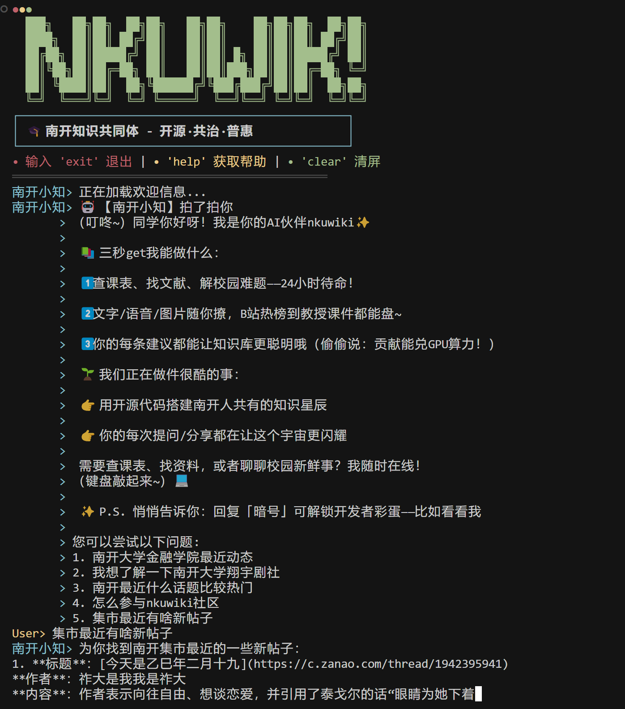
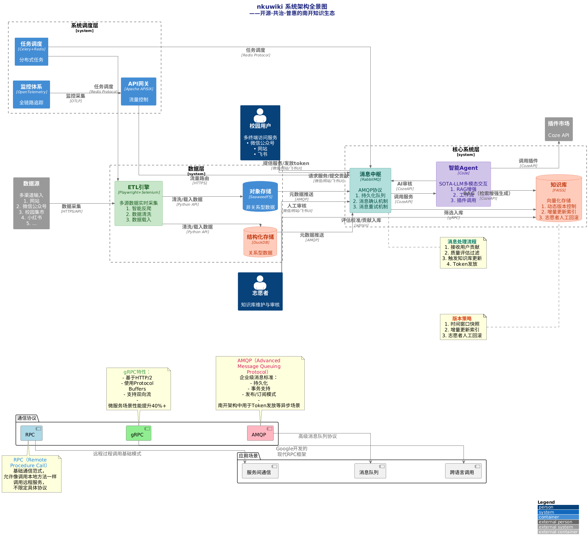
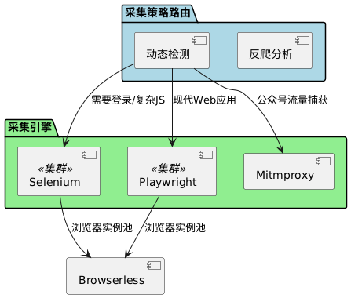
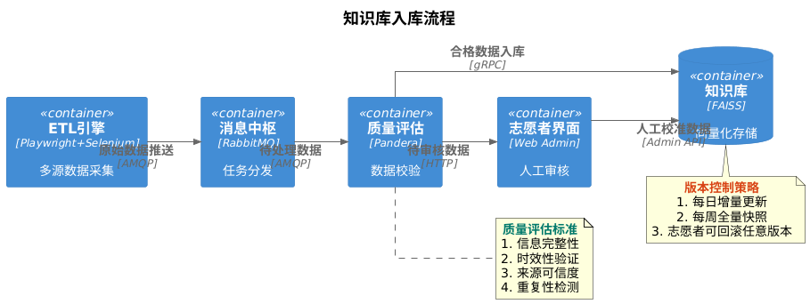
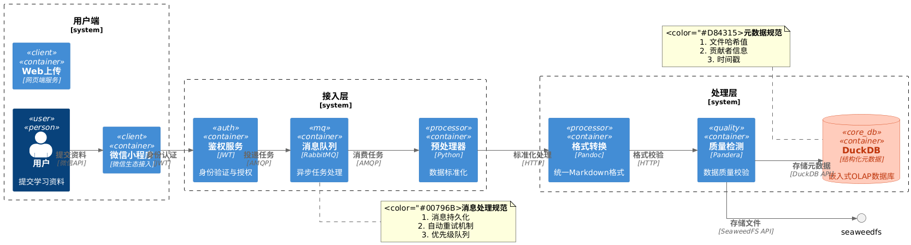
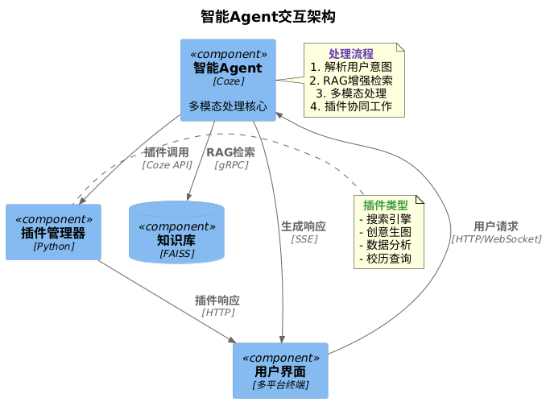
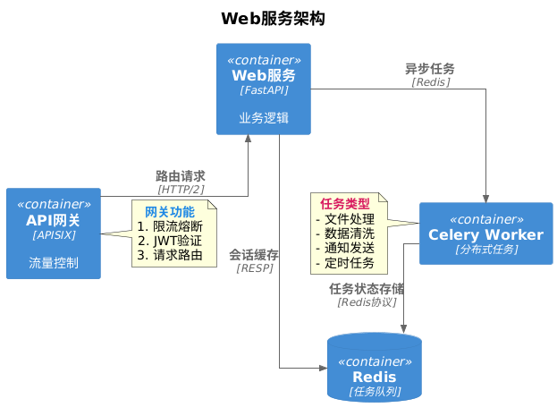

# nkuwiki 开源·共治·普惠的南开百科

[](LICENSE)[](https://github.com/your-org/nkuwiki/releases)

## 🚀 立即体验

- 🔗 [Coze](https://www.coze.cn/store/agent/7473464038963036186?bot_id=true&bid=6ffcvvj3k6g0j)

- 🔗 [Hiagent](https://coze.nankai.edu.cn/product/llm/chat/cuh2gospkp8br093l2eg)

- 🤖 企微机器人参考[三步将nkuwiki bot添加到你的群](https://nankai.feishu.cn/wiki/UT4EwiPxmisBdOk3d1ycnGR2nve?from=from_copylink)

- 🔎 微信服务号：nkuwiki知识社区（无限制，用户体验更好）

- 🗝️ 微信订阅号 nkuwiki（有消极回复限制）

## 📇 目录

- [nkuwiki 开源·共治·普惠的南开百科](#nkuwiki-开源共治普惠的南开百科)
  - [🚀 立即体验](#-立即体验)
  - [📇 目录](#-目录)
  - [⚡ 快速开始](#-快速开始)
    - [终端模式演示](#终端模式演示)
  - [🎯 愿景与目标](#-愿景与目标)
  - [🤝 如何参与](#-如何参与)
  - [🏗 系统架构图](#-系统架构图)
  - [📅 演进路线](#-演进路线)
  - [💻 技术实现](#-技术实现)
    - [项目结构树](#项目结构树)
    - [技术选型表](#技术选型表)
    - [核心模块实现](#核心模块实现)
      - [爬虫混合架构实现方案](#爬虫混合架构实现方案)
      - [知识库入库流程](#知识库入库流程)
      - [用户贡献管道](#用户贡献管道)
      - [agent交互架构](#agent交互架构)
      - [web服务架构](#web服务架构)
  - [🤖 通道使用指南](#-通道使用指南)

## ⚡ 快速开始

nkuwiki项目是一个开源的南开百科知识共享平台，提供智能问答服务。以下是快速开始使用的步骤：

1. **安装与环境准备**：详细步骤请参考[安装指南](./docs/installation_guide.md)
2. **配置项目**：详细配置说明请参考[配置指南](./docs/configuration_guide.md)
3. **部署运行**：部署MySQL、Qdrant等服务，请参考[部署指南](./docs/deployment_guide.md)

### 终端模式演示

以下是在终端模式下快速启动nkuwiki的步骤：

```bash
# 克隆仓库并进入项目目录
git clone https://github.com/NKU-WIKI/nkuwiki.git
cd nkuwiki

# 安装依赖
pip install -r requirements.txt

# 复制终端配置模板
cp config-template/config-terminal.json config.json

# 编辑config.json，填入您的bot_id和api_key
# 使用任意文本编辑器打开config.json文件
# "bot_id": ["your_bot_id_here"] 替换为您的bot_id
# "api_key": "" 替换为您的api_key

# 启动终端服务
python app.py
```

效果图


详细文档请参考[docs](./docs)目录。

## 🎯 愿景与目标

我们致力于构建**南开知识共同体**，践行 **开源·共治·普惠** 三位一体价值体系
（🔓 技术开源透明 + 🤝 社区协同共治 + 🆓 服务永久普惠），实现：

- 🚀 **消除南开学子信息差距**

- 💡 **开放知识资源免费获取**

- 🌱 **构建可持续的互助社区**

**项目亮点**：

- 🤖 **开源知识中枢**
  - 🧠 双擎驱动：**RAG**框架 + **SOTA**模型推理
  - 🔄 **动态知识图谱**
    - 🔓 接入**南开全渠道数据源**（网站/微信公众号/校园集市/小红书/微博/抖音/B站/知乎etc.）
    - 🤝 **社区共治**：志愿者团队与用户协同维护
    - 🛡️ **开源评估框架**（贡献者透明审计）
  - 🔍 多模态和丰富插件支持
    - 支持文本/语音/图像/视频全感官知识获取
    - 丰富插件支持：搜索引擎、创意生图、数据分析etc.

- 👥 **普惠共治机制**
  - 三维协同架构：
    - 💻 **技术层**：开源社区维护核心栈
    - ⚖️ **治理层**：DAO式内容审核委员会
    - 👤 **应用层**：贡献即治理（1Token=1投票权）

- 💎 **贡献流通系统**：
  - 🎁 **激励全周期覆盖**（采集/清洗/标注）
  - ♻️ **数字权益兑换**：
    - ⚡ 优先计算资源
    - 🎚️ 个性化知识门户
    - 🗳️ 治理代议席位

## 🤝 如何参与

⭐ **联系方式**：您可以直接添加微信 `ao_kimi` ，飞书联系 @廖望，或者联系开发团队与志愿者团队任意成员。

🌱 **使用即贡献，贡献即治理**：您可以通过使用我们的服务，联系我们反馈您的宝贵意见，向朋友安利我们的服务，上传您认为有价值的资料，在我们的项目提issue或PR，或者直接加入开发团队与志愿者团队等多种方式为社区发展作出贡献。我们欢迎任何形式，不计大小的贡献！

现任开发团队

- [@aokimi0](https://github.com/aokimi0)

- [@LiaojunChen](https://github.com/LiaojunChen)

- [@hht421](https://github.com/hht421)

- [@Frederick2313072](https://github.com/Frederick2313072)

- [@Because66666](https://github.com/Because66666)

现任志愿者团队

- [@aokimi0](https://github.com/aokimi0)

- [@hht421](https://github.com/hht421)

- [@hengdaoye50](https://github.com/hengdaoye50)

- [@Because66666](https://github.com/Because66666)

## 🏗 系统架构图



## 📅 演进路线

| 阶段 | 关键里程碑 | 技术栈与架构决策 | 交付产物 |
| --- | --- | --- | --- |
| **MVP启动期** | ✅ 核心服务上线 | 🛠 FastAPI（API网关） | 📦 容器化核心服务 |

| (0-3月) | ▪ 微信公众号智能问答MVP | 🤖 Coze（智能Agent） | 📚 部署指南+运维手册 |
|  | ▪ 动态爬虫框架1.0 | 🕷 Playwright（自动化爬虫） | 🔍 知识库检索API文档 |

|  | ▪ 重点平台数据接入（官网/公众号） |  |  |
|  | ▪ 知识库基础检索功能 |  |  |
| **生态构建期** | 🚀 核心系统扩展 | 🕸 Scrapy（分布式爬虫） | 🧩 可插拔爬虫框架 |

| (4-6月) | ▪ 全平台爬虫覆盖 | 📊 Prometheus+Granfana（监控） | 📈 质量评估系统 |
|  | ▪ 数据质量看板1.0 | 🔐 JWT+RBAC（权限控制） | 🪙 Token激励原型系统 |

|  | ▪ 用户贡献系统原型 |  |  |
|  | ▪ 反爬策略增强 |  |  |
| **体系升级期** | 🌟 系统架构演进 | ☁ Spring Cloud Alibaba（微服务） | 🔄 积分系统微服务集群 |

| (7-9月) | ▪ 微服务化改造 | 📦 ELK（日志分析） | 👁️ 系统健康看板 |
|  | ▪ 分布式积分系统 | 🧠 Milvus（向量检索） | 🎨 多模态处理SDK |

|  | ▪ 全链路监控体系 |  |  |
|  | ▪ 多模态知识引擎 |  |  |

**小团队演进策略**：

1. 🎯 功能优先级：采用「剃刀原则」聚焦核心场景，首期仅保留问答/检索/基础爬虫功能

2. 🧪 验证驱动：Token机制先实现简单积分发放，二期再引入兑换/消费闭环

3. 📶 渐进接入：平台接入按「官网→公众号→校园集市→社交平台」顺序分阶段实施

4. 🚧 架构演进：从单体→模块化→微服务渐进式改造，避免早期过度设计

## 💻 技术实现

### 项目结构树

```plaintext

- core # core模块，负责智能体对话、贡献激励、平台治理等算法应用
  - agent  # 智能体应用
    - coze  # Coze平台对接
      - coze_agent.py
    （openai,chatgpt,hiagent、etc.）
    - session_manager.py  # 会话管理器
    - agent_factory.py  # 智能体工厂
  - auth  # 处理认证和授权
  - bridge  # 桥接服务与智能体
  - utils  # 通用工具函数和类
    - plugins  # 插件管理系统
      - plugin_manager.py  # 插件管理器
    - common  # 通用工具库
    - voice  # 语音处理
    - translate  # 翻译工具

- docs  # 项目文档
  - installation_guide.md  # 安装指南
  - configuration_guide.md  # 配置指南
  - deployment_guide.md  # 部署指南
  - logging_guide.md  # 日志指南
  - assets  # 文档资源
    - 技术报告.pdf
  - HiagentAPI  # HiAgent API文档
    - HiagentAPI.md

- etl  # etl模块，负责数据抽取、转换和加载
  - __init__.py  # etl模块全局共享配置项、环境变量、路径和工具函数
  - api  # 检索和生成服务的api
  - crawler  # 爬虫模块，负责从各种数据源抓取数据
    - base_crawler.py  # 基础爬虫类
    (website,wechat, market, etc.)
    - __init__.py  # 爬虫模块专用配置项、环境变量、路径和工具函数
  - transform  # 转换模块，负责数据格式转换、处理和清洗
    - transformation.py  # 转换工具
  - load  # 加载模块，将原始数据导出到索引数据,关系数据库（mysql）和向量数据库（qdrant）
    - mysql_tables # mysql建表语句
    - json2mysql.py  # JSON数据导入MySQL
    - pipieline.py # 文档索引建立、嵌入、检索、重排全流程
  - embedding  # 嵌入处理模块
    - hierarchical.py # 文档处理成节点树，建立索引
    - ingestion.py  # 文档分块、嵌入
    - hf_embeddings.py # 嵌入模型
  - retrieval  # 检索模块
    - retrivers.py # 稀疏/稠密/混合检索器
    - rerankders.py # 重排器
  - utils  # 工具
  - data # 数据持久化存储目录，gitignore，一般放在项目代码外，仅本地测试时放在项目中，可在config.json中配置挂载路径
    - cache  # 缓存目录，存储临时处理的数据
    - index  # 索引目录，存储建立的搜索索引
    - models  # 模型目录，存储下载的机器学习模型
    - mysql  # MySQL数据库目录，存储关系型数据
    - qdrant  # Qdrant向量数据库目录，存储向量检索数据
    - nltk  # NLTK数据目录，存储自然语言处理工具包数据
    - raw  # 原始数据目录，存储爬取的原始数据

- infra  # 基础设施
  - __init__.py

- services  # services模块，提供多渠道服务
  - wechatmp  # 微信公众号服务
    - active_reply.py  # 主动回复
    - passive_reply.py  # 被动回复
    - wechatmp_channel.py  # 微信公众号渠道
  - terminal  # 终端服务，调试用
  - website  # 网站服务
  - channel_factory.py  # 渠道工厂

- requirements.txt  # 项目依赖文件

- app.py  # 应用程序入口

- config.py  # 全局配置管理类，包含所有可用配置项的注释和默认值

- config.json  # 配置文件，包含敏感信息，gitignore

- .cursors # cursor项目规则，推荐开发使用

```

### 技术选型表

| 模块 | 子模块 | 技术栈 | 版本 | 选型依据 |
| --- | --- | --- | --- | --- |

| **爬虫引擎** | 混合采集架构 | Playwright + Selenium | 1.42.0 / 4.18.0 | 双引擎覆盖现代SPA与传统网页场景，Playwright处理复杂DOM性能提升40% |
|  | 反爬解决方案 | Browserless + mitmproxy | 2.7.0 / 10.1.0 | 分布式浏览器指纹混淆 + 公众号API流量镜像捕获能力 |
| **数据清洗** | 数据清洗 | Pandera + DuckDB | 0.11.0 / 0.9.2 | 声明式数据验证框架 + 列式存储实时处理能力 |
| **消息队列** | 用户贡献处理 | RabbitMQ | 3.13.0 | 支持AMQP 1.0协议，消息持久化与死信队列保障数据完整性 |

| **存储层** | 对象存储 | SeaweedFS | 3.64 | 对象存储与文件系统统一接口，自动纠删码机制 |
|  | 元数据存储 | DuckDB | 0.9.2 | 支持Python原生OLAP查询，向量化执行引擎加速 |
| **任务调度** | 分布式任务 | Celery + Redis | 5.3.6 / 7.2.4 | 支持优先级队列与任务状态追踪，Redis Streams保障消息可靠性 |
| **监控体系** | 链路追踪 | OpenTelemetry | 1.24.0 | 统一观测数据标准，支持Metrics/Logs/Traces三支柱 |
| **核心组件** | API网关 | Apache APISIX | 3.8.0 | 动态插件架构支持JWT鉴权/限流/熔断等策略热更新 |

| **Agent模块** | API交互层 | FastAPI + HTTPX | 0.110.0 | 异步HTTP客户端支持SSE/WebSocket长连接 |
|  | 多模态处理 | Coze Multi-Modal API | 2024.2 | 支持文生图/图生文多模态联合推理 |

| **微信服务** | 消息路由 | FastAPI WebSocket | 0.110.0 | 支持万人级并发消息推送，消息压缩率60%+ |
|  | 任务调度 | Celery | 5.3.6 | 支持定时任务与工作流编排，任务失败自动重试 |

| **基础设施** | 容器编排 | Docker Compose | 2.24.5 | 支持服务依赖管理，开发-生产环境一致性保障 |
|  | 日志管理 | Loki + Promtail | 2.9.4 | 支持日志标签化索引，存储空间节省70% |

### 核心模块实现

#### 爬虫混合架构实现方案



说明：

1. **复杂登录场景**：使用Selenium处理南开教务系统等需要模拟完整登录流程的系统（[BrowserStack指南](https://www.browserstack.com/guide/web-scraping-using-selenium-python)）。

2. **混合抓包模式**：结合Mitmproxy+Selenium Wire实现公众号API请求捕获（[Scrape-it案例](https://scrape-it.cloud/blog/web-scraping-using-selenium-python)）。

3. **反反爬策略**：通过Browserless集群实现IP轮换和浏览器指纹混淆。

4. **性能平衡**：Playwright处理现代Web应用（B站/小红书），Selenium专注复杂传统系统。

#### 知识库入库流程



#### 用户贡献管道



#### agent交互架构



#### web服务架构



## 🤖 通道使用指南

本项目支持多种通道接入，包括终端、微信公众号、企业微信等。详细配置和使用说明请参考[配置指南](./docs/configuration_guide.md)中的通道配置部分。

# 南开Wiki微信小程序数据迁移方案

本方案用于将微信小程序云数据库中的数据（帖子、用户、评论等）迁移到南开Wiki后端数据库。

## 方案概述

本方案采用两种同步机制：

1. **后端主动拉取**: 通过南开Wiki后端的爬虫模块，主动从微信小程序获取数据
2. **前端主动推送**: 在微信小程序端增加同步功能，将数据主动推送给南开Wiki后端

## 系统架构

```
+---------------------+        +---------------------+
|  微信小程序云数据库   |        |     南开Wiki后端     |
|  (posts, users)     |<------>|     MySQL数据库      |
+---------------------+        +---------------------+
         ^                              ^
         |                              |
         |      +----------------+      |
         +----->| 同步中间层API   |<-----+
                +----------------+
```

## 功能实现

### 1. 后端实现

#### 1.1 数据库表创建

创建了三个表用于存储微信小程序数据：
- `wxapp_posts`: 存储帖子数据
- `wxapp_users`: 存储用户数据
- `wxapp_comments`: 存储评论数据

#### 1.2 数据采集模块

`etl/crawler/wechat_mini.py`：微信小程序数据采集工具类，支持：
- 全量同步：一次性获取所有数据
- 增量同步：只获取上次同步后的新数据
- 数据转换：将微信小程序数据格式转换为南开Wiki数据库格式

#### 1.3 数据导出API

`etl/api/wxapp_export.py`：提供将南开Wiki数据库数据导出给微信小程序的API接口。
- `/api/wxapp/export_data`: 支持导出posts和users数据

### 2. 前端实现

#### 2.1 数据同步工具

`services/app/sync_wxapp_data.js`：微信小程序端的数据同步工具，提供：
- 全量同步：`syncAllData()`
- 增量同步：`incrementalSync(startTime)`
- 单集合同步：`syncCollection(collection)`

## 使用方式

### 1. 配置设置

1. 在配置文件中设置API密钥：
   ```python
   # config.json
   {
     "etl": {
       "api": {
         "wxapp_export": {
           "secret_key": "your_secret_api_key"
         }
       },
       "crawler": {
         "wechat_mini": {
           "api_url": "http://your_wxapp_api_url/api",
           "api_key": "your_secret_api_key"
         }
       }
     }
   }
   ```

2. 在微信小程序中设置API地址和密钥：
   ```javascript
   // sync_wxapp_data.js
   const config = {
     apiUrl: 'https://your_nkuwiki_api_url/api/wxapp/export_data',
     apiKey: 'your_secret_api_key'
   };
   ```

### 2. 执行同步

#### 2.1 后端主动拉取

```python
# 在南开Wiki后端执行
python -m etl.crawler.wechat_mini
```

#### 2.2 前端主动推送

```javascript
// 在微信小程序中调用
const syncUtils = require('./sync_wxapp_data');

// 全量同步
syncUtils.syncAllData().then(result => {
  console.log('同步结果:', result);
});

// 增量同步
const lastSyncTime = '2023-04-01T00:00:00Z';  // ISO8601格式
syncUtils.incrementalSync(lastSyncTime).then(result => {
  console.log('增量同步结果:', result);
});
```

## 数据映射

微信小程序数据库字段和南开Wiki数据库字段的映射关系：

### 帖子表映射
| 微信小程序字段 | 南开Wiki字段 |
|--------------|-------------|
| _id | wxapp_id |
| authorId | author_id |
| authorName | author_name |
| authorAvatar | author_avatar |
| content | content |
| likes | likes |
| likedUsers | liked_users (JSON) |
| favoriteUsers | favorite_users (JSON) |
| comments | 单独存储到wxapp_comments表 |
| images | images (JSON) |
| tags | tags (JSON) |
| createTime | create_time |
| updateTime | update_time |

### 用户表映射
| 微信小程序字段 | 南开Wiki字段 |
|--------------|-------------|
| _id | wxapp_id |
| openid | openid |
| unionid | unionid |
| nickName | nickname |
| avatarUrl | avatar_url |
| gender | gender |
| country | country |
| province | province |
| city | city |
| language | language |
| createTime | create_time |
| updateTime | update_time |
| lastLogin | last_login |

## 维护与监控

- 日志记录：同步过程的详细日志存储在`etl/logs/etl.log`文件中
- 同步状态：最近同步时间记录在`etl/data/cache/wxapp_last_sync.txt`文件中
- 错误处理：同步过程中的错误会被捕获并记录，不会影响系统正常运行

## 安全性考虑

- API密钥验证：所有API请求需要提供有效的密钥才能访问
- 数据验证：所有输入数据都经过验证和清洗，防止注入攻击
- 数据隔离：微信小程序数据存储在独立的表中，不影响现有系统

## 扩展性

本方案采用模块化设计，易于扩展：
- 支持添加更多数据表
- 支持添加更多同步方式
- 支持添加更多数据源

## 进一步改进

- 添加定时同步任务，定期从微信小程序拉取数据
- 实现双向同步，支持南开Wiki数据反向同步到微信小程序
- 增加数据差异对比，只同步有变化的记录
- 添加数据冲突解决机制
