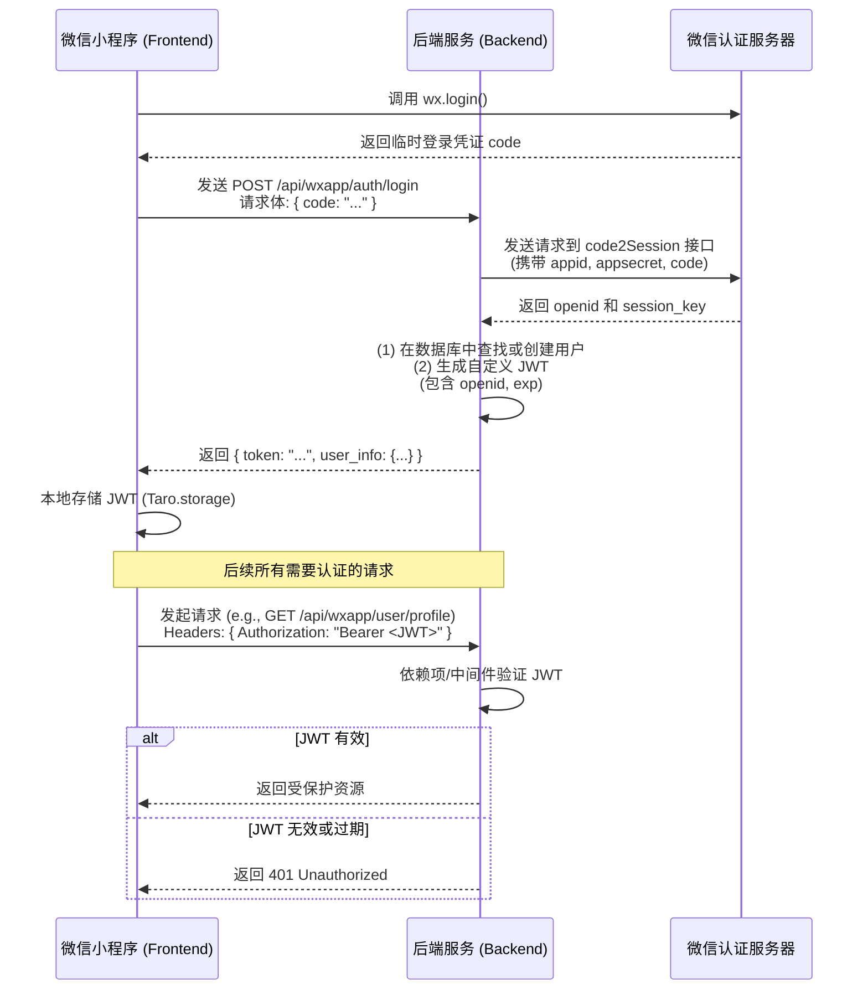

# 微信小程序登录与后端鉴权方案

## 1. 概述

本文档旨在为 `nkuwiki` 项目设计并记录一个安全、可靠且遵循业界最佳实践的微信小程序用户登录与后端鉴权方案。

原有的 `/api/wxapp/user/sync` 接口存在严重安全漏洞，它直接信任并接收客户端发送的 `openid`，这使得任何人都可能通过伪造 `openid` 冒充其他用户。

本方案将彻底取代旧有逻辑，通过实现一个标准的、基于 `JWT (JSON Web Token)` 的认证流程来解决此问题，确保用户身份的真实性和后续 API 调用的安全性。

## 2. 认证流程

整体认证流程基于微信官方推荐的 `wx.login()` 机制，并结合后端的 JWT 签发与验证。



## 3. 后端改造 (`FastAPI`)

### 3.1. 依赖与配置

-   **新增依赖**: 在 `requirements.txt` 中添加以下库：
    -   `python-jose[cryptography]`: 用于 JWT 的编码和解码。
    -   `passlib[bcrypt]`: 虽然本次不直接处理密码，但它是 `python-jose` 的一个推荐依赖，用于加密算法。

-   **新增配置**: 在 `config.json` 中，为 `services` 新增 `wxapp.auth` 配置节，用于管理敏感信息：
    ```json
    {
      "services": {
        "wxapp": {
          "auth": {
            "appid": "你的小程序AppID",
            "appsecret": "你的小程序AppSecret",
            "jwt_secret": "一个足够复杂的随机密钥",
            "jwt_algorithm": "HS256",
            "jwt_expires_in_days": 30
          }
        }
      }
    }
    ```

### 3.2. 新增登录接口

-   **文件**: `api/routes/wxapp/auth.py`
-   **路由**: `POST /api/wxapp/auth/login`
-   **请求体**:
    ```json
    {
      "code": "string" // wx.login() 获取的临时凭证
    }
    ```
-   **核心逻辑**:
    1.  接收前端传来的 `code`。
    2.  调用微信 `code2Session` 接口，用 `code` 换取用户的真实 `openid` 和 `session_key`。
    3.  使用 `openid` 在 `wxapp_users` 表中查找用户。如果用户不存在，则创建一个新用户。
    4.  调用内部函数 `_create_access_token`，使用 `openid` 和配置的过期时间生成一个 JWT。
    5.  将生成的 JWT 和基础用户信息返回给前端。
-   **响应体**:
    ```json
    {
      "token": "string", // 生成的 JWT
      "user_info": { // 用户基础信息
        "id": "integer",
        "openid": "string",
        "nickname": "string",
        "avatar": "string",
        // ... 其他字段
      }
    }
    ```

### 3.3. JWT 鉴权依赖

为了保护需要登录才能访问的接口，我们创建了两个可复用的 FastAPI 依赖项，它们会自动从请求头的 `Authorization` 字段中解析和验证 JWT。

-   **文件**: `api/routes/wxapp/auth.py`

1.  **`get_current_user_openid(token: str = Depends(oauth2_scheme)) -> str`**:
    -   **用途**: 用于需要 **强制登录** 的接口。
    -   **行为**: 验证 JWT。如果令牌有效且未过期，返回 `openid`。如果令牌无效、缺失或过期，则直接抛出 `HTTP 401 Unauthorized` 异常，终止请求。

2.  **`get_current_user_openid_optional(request: Request) -> Optional[str]`**:
    -   **用途**: 用于 **可选登录** 的接口（例如，查看帖子列表，登录后可以额外显示是否点赞）。
    -   **行为**: 检查是否存在有效的 JWT。如果存在，返回 `openid`；如果不存在或无效，返回 `None`，不会中断请求。

### 3.4. 加固现有接口

所有原先直接接收 `openid` 作为参数的 `wxapp` 路由都将被重构，以使用上述的鉴权依赖。

-   **示例 (前)**:
    ```python
    @router.post("/like")
    async def like_post(data: dict):
        openid = data.get("openid")
        post_id = data.get("post_id")
        # ... 业务逻辑
    ```

-   **示例 (后)**:
    ```python
    from .auth import get_current_user_openid

    @router.post("/like")
    async def like_post(data: dict, openid: str = Depends(get_current_user_openid)):
        post_id = data.get("post_id")
        # ... 业务逻辑 (openid 已被验证，可直接使用)
    ```

## 4. 前端改造 (`Taro/React`)

### 4.1. 状态管理 (`Redux Toolkit`)

为了在整个应用中管理用户的认证状态和信息，我们引入了 Redux Toolkit。

-   **文件**: `src/store/slices/userSlice.ts`
-   **State 结构**:
    ```typescript
    interface UserState {
      token: string | null;
      isAuthenticated: boolean;
      profile: UserProfile | null;
      status: 'idle' | 'loading' | 'succeeded' | 'failed';
      error: string | null;
    }
    ```
-   **核心 Actions (Async Thunks)**:
    1.  **`loginWithWeChat()`**:
        -   调用 `Taro.login()` 获取 `code`。
        -   调用后端的 `POST /api/wxapp/auth/login` 接口。
        -   成功后，将返回的 `token` 和 `user_info` 存入 Redux store，并持久化 `token` 到 `Taro.storage`。
    2.  **`fetchUserProfile()`**:
        -   调用后端的 `GET /api/wxapp/user/profile` 接口（该接口受 `get_current_user_openid` 保护）。
        -   成功后，更新 Redux store 中的 `profile` 信息。

### 4.2. 请求拦截器

项目的请求拦截器 (`src/services/request.ts`) 已被配置，它会在每个发出的请求的 `Authorization` 头中自动附带存储在 `Taro.storage` 中的 JWT。

```typescript
// request.ts (简化逻辑)
const token = Taro.getStorageSync('token');
if (token) {
  options.header.Authorization = `Bearer ${token}`;
}
```

### 4.3. UI 改造

-   **文件**: `src/pages/profile/index.tsx`
-   **核心逻辑**:
    -   页面组件通过 `useAppSelector` 连接到 Redux store，监听 `isAuthenticated` 状态。
    -   **未登录时**: 显示一个 "微信一键登录" 按钮。点击该按钮会 `dispatch(loginWithWeChat())`。
    -   **登录后**:
        -   `isAuthenticated` 变为 `true`。
        -   页面触发 `dispatch(fetchUserProfile())` 来获取完整的用户信息。
        -   显示从 `state.user.profile` 中获取的真实用户昵称、头像等信息，取代之前的静态模拟数据。

通过以上改造，我们建立了一个完整、安全、可维护的闭环认证系统。 