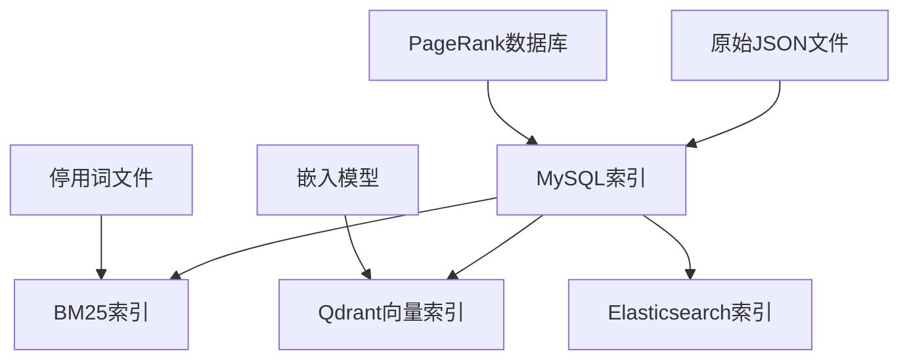

# ETL索引构建模块

本模块提供了统一的索引构建接口，支持四种不同类型的索引：

- **MySQL索引**: 原始数据导入到MySQL数据库
- **BM25索引**: 基于词频的文本检索索引
- **Qdrant向量索引**: 基于语义嵌入的向量检索索引
- **Elasticsearch索引**: 支持通配符查询的全文检索索引

## 模块特性

- **模块化设计**: 每种索引类型都有独立的构建器
- **统一接口**: 所有构建器都返回标准化的结果格式
- **配置驱动**: 支持通过配置文件设置默认参数
- **错误处理**: 完善的错误处理和日志记录
- **依赖解耦**: 各模块间互不依赖，可独立使用

## 快速开始

### 1. 使用统一脚本

```bash
# 构建所有索引
python etl/import_and_index.py --all

# 只构建特定索引
python etl/import_and_index.py --mysql --bm25

# 构建时限制记录数量（测试用）
python etl/import_and_index.py --all --limit 1000

# 查看所有选项
python etl/import_and_index.py --help
```

### 2. 在代码中使用

```python
from etl.indexing import (
    build_mysql_index,
    build_bm25_index,
    build_qdrant_index,
    build_elasticsearch_index
)

# 构建MySQL索引
mysql_result = build_mysql_index(
    data_dir="/data/raw/website/nku",
    include_documents=True,
    batch_size=100
)

# 构建BM25索引
bm25_result = build_bm25_index(
    output_path="/data/index/bm25_nodes.pkl",
    limit=1000
)

# 构建Qdrant向量索引
qdrant_result = build_qdrant_index(
    collection_name="main_index",
    embedding_model="BAAI/bge-large-zh-v1.5",
    chunk_size=512
)

# 构建Elasticsearch索引
es_result = build_elasticsearch_index(
    index_name="nkuwiki",
    es_host="localhost",
    es_port=9200
)
```

## 各模块详细说明

### MySQL索引构建器 (`mysql_indexer.py`)

负责将原始JSON数据导入MySQL数据库，包括PageRank分数整合和文档内容解析。

**参数:**
- `data_dir`: 数据目录路径 (默认: 从配置读取)
- `include_documents`: 是否解析文档内容 (默认: True)
- `batch_size`: 批处理大小 (默认: 100)
- `pagerank_db_path`: PageRank数据库路径 (默认: 从配置读取)

**返回值:**
```json
{
    "total_files": 69632,
    "success": 65000,
    "errors": 4632
}
```

### BM25索引构建器 (`bm25_indexer.py`)

从MySQL数据构建BM25文本检索索引，支持中文分词和停用词过滤。

**参数:**
- `output_path`: 索引输出路径 (默认: 从配置读取)
- `stopwords_path`: 停用词文件路径 (默认: 从配置读取)
- `bm25_type`: BM25算法类型 (0: BM25Okapi, 1: BM25)
- `limit`: 限制处理的记录数量

**返回值:**
```json
{
    "total_nodes": 65000,
    "success": true,
    "output_path": "/data/index/bm25_nodes.pkl",
    "bm25_type": 0
}
```

### Qdrant向量索引构建器 (`qdrant_indexer.py`)

从MySQL数据构建向量检索索引，支持文本分块和语义嵌入。

**参数:**
- `collection_name`: Qdrant集合名称 (默认: 从配置读取)
- `embedding_model`: 嵌入模型名称 (默认: 从配置读取)
- `qdrant_url`: Qdrant服务器URL (默认: 从配置读取)
- `chunk_size`: 文本分块大小 (默认: 512)
- `chunk_overlap`: 分块重叠大小 (默认: 200)
- `limit`: 限制处理的记录数量
- `batch_size`: 批处理大小 (默认: 100)

**返回值:**
```json
{
    "total_nodes": 150000,
    "success": true,
    "collection_name": "main_index",
    "vector_size": 1024,
    "embedding_model": "BAAI/bge-large-zh-v1.5"
}
```

### Elasticsearch索引构建器 (`elasticsearch_indexer.py`)

从MySQL数据构建Elasticsearch全文检索索引，支持通配符查询。

**参数:**
- `index_name`: Elasticsearch索引名称 (默认: 从配置读取)
- `es_host`: Elasticsearch主机 (默认: 从配置读取)
- `es_port`: Elasticsearch端口 (默认: 从配置读取)
- `limit`: 限制处理的记录数量
- `batch_size`: 批处理大小 (默认: 1000)
- `recreate_index`: 是否重新创建索引 (默认: True)

**返回值:**
```json
{
    "total_records": 65000,
    "success": true,
    "indexed": 64950,
    "errors": 50,
    "index_name": "nkuwiki"
}
```

## 配置文件

模块会从 `config.json` 中读取默认配置，相关配置项：

```json
{
    "etl": {
        "data": {
            "base_path": "/data",
            "qdrant": {
                "url": "http://localhost:6333",
                "collection": "main_index",
                "vector_size": 1024
            },
            "elasticsearch": {
                "host": "localhost",
                "port": 9200,
                "index": "nkuwiki"
            }
        },
        "embedding": {
            "name": "BAAI/bge-large-zh-v1.5"
        },
        "retrieval": {
            "bm25": {
                "nodes_path": "/data/index/bm25_nodes.pkl",
                "stopwords_path": "/data/nltk/hit_stopwords.txt"
            }
        }
    }
}
```

## 依赖关系



- **MySQL索引**: 是其他所有索引的数据源
- **PageRank数据库**: 为MySQL索引提供权威性分数
- **嵌入模型**: 为Qdrant索引提供向量嵌入
- **停用词文件**: 为BM25索引提供中文停用词

## 错误处理

所有构建器都提供统一的错误处理机制：

1. **参数验证**: 自动验证输入参数的有效性
2. **连接检查**: 检查外部服务（MySQL、Qdrant、Elasticsearch）的连接
3. **数据验证**: 验证数据格式和内容的有效性
4. **错误恢复**: 对于批量操作，单个错误不会影响整个过程
5. **详细日志**: 提供详细的错误信息和调试日志

## 性能优化

- **批处理**: 所有操作都支持批处理以提高性能
- **并行处理**: Elasticsearch支持并行批量索引
- **内存管理**: 大文件处理采用流式处理避免内存溢出
- **缓存优化**: 嵌入模型结果缓存到本地
- **连接复用**: 数据库连接采用连接池管理

## 监控和调试

- **进度显示**: 使用tqdm显示处理进度
- **性能统计**: 记录处理时间和吞吐量
- **错误统计**: 统计成功和失败的记录数量
- **日志分级**: 支持不同级别的日志输出
- **试运行模式**: 支持试运行以验证配置 